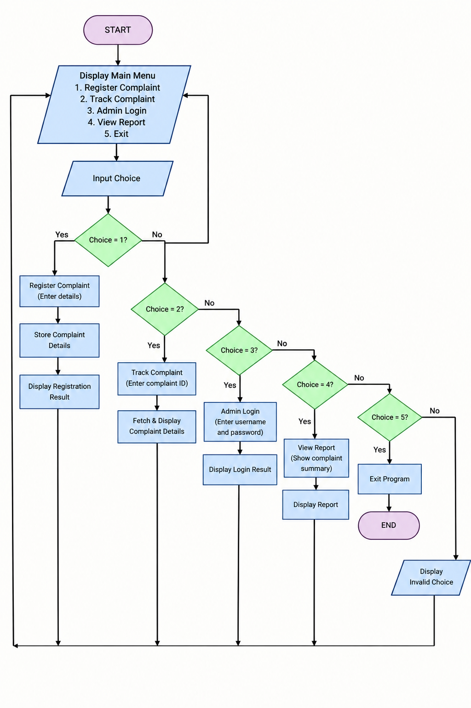

# System Architecture

## 1. Architecture Description

• The HostelEase system follows a simple modular architecture:

(i) Main Controller (main.py):
  - Controls the main menu of the system.
  - Takes the user's choice.
  - Connects all the different modules.

(ii) Complaint Registration (complaint.py):
  - Collects student and complaint details.
  - Validates complaint category and priority.
  - Creates the complaint record.

(iii) Complaint Tracking (tracking.py):
  - Takes the complaint ID as input.
  - Checks whether the complaint exists.
  - Displays the complaint details.

(iv) Admin Login (admin.py):
  - Takes the administrator username and password.
  - Checks the entered login details.
  - Displays the login result.

(v) View Reports (reports.py):
  - Displays the registered complaint information.
  - Shows the complaint details in an organized format.

(vi) Data Flow:
  - The user interacts with the main menu.
  - The selected option is passed to the respective module.
  - The module processes the input and displays the result.
  - After completing an operation, the system returns to the main menu.
  
  
  

## 2. System Workflow

• The overall workflow of HostelEase is:

Start → Main Menu → Select Option → Process Request → Display Result → Return to Main Menu → Exit

## 3. Process Flowchart

The following flowchart represents the overall working process of the HostelEase system.

