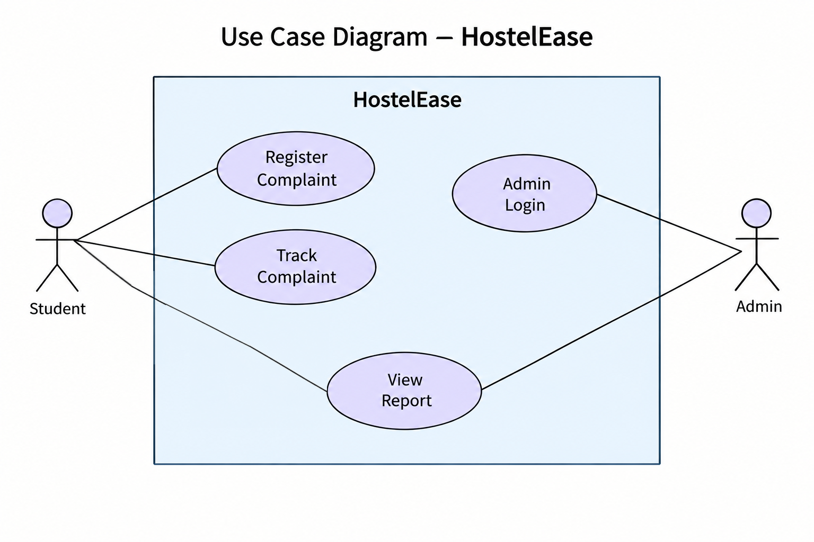

# Design Diagrams

1. Use Case Diagram:

    • The Use Case Diagram shows the             interaction between the users and the HostelEase system.

    

    • Actors:

        - Student: Can register a complaint, track a complaint, and view the complaint report.
        - Admin: Can access the admin login and view the complaint report.

    • Use Cases:

        - Register Complaint
        - Track Complaint
        - Admin Login
        - View Report
    
    
    
 
 2. Class Diagram:

    A class diagram is not applicable to the     current version of HostelEase because the system is implemented using procedural Python programming with functions and dictionaries rather than classes and objects.
    